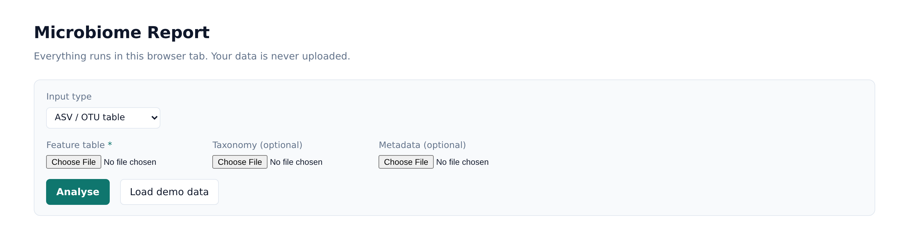
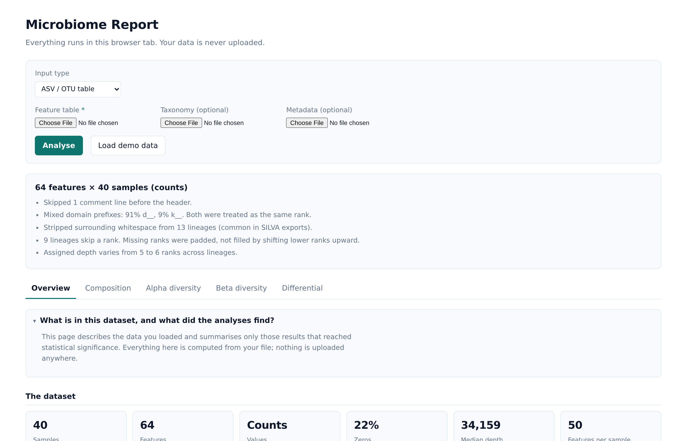
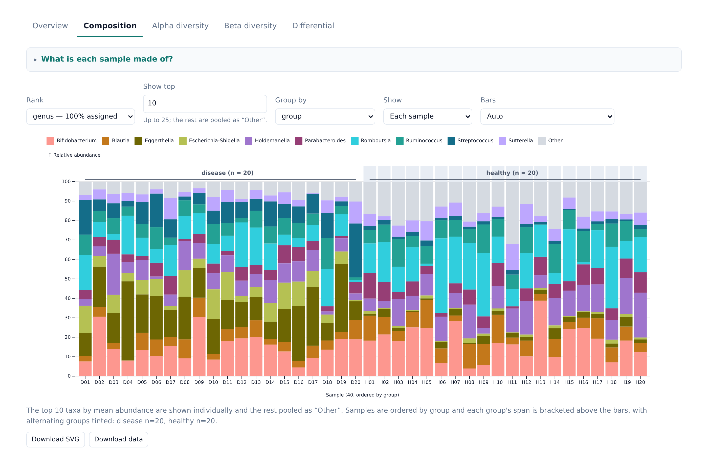
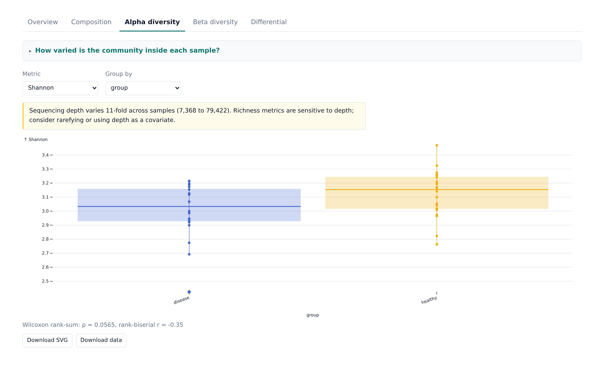
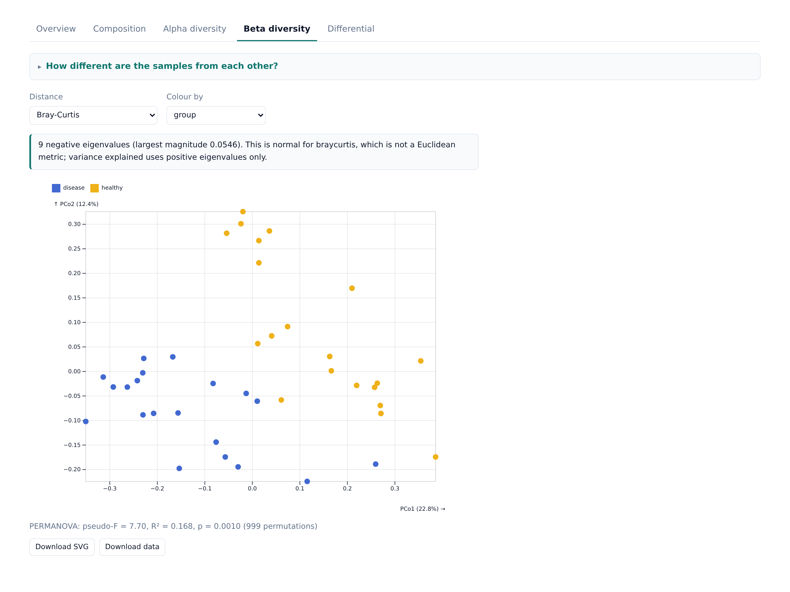
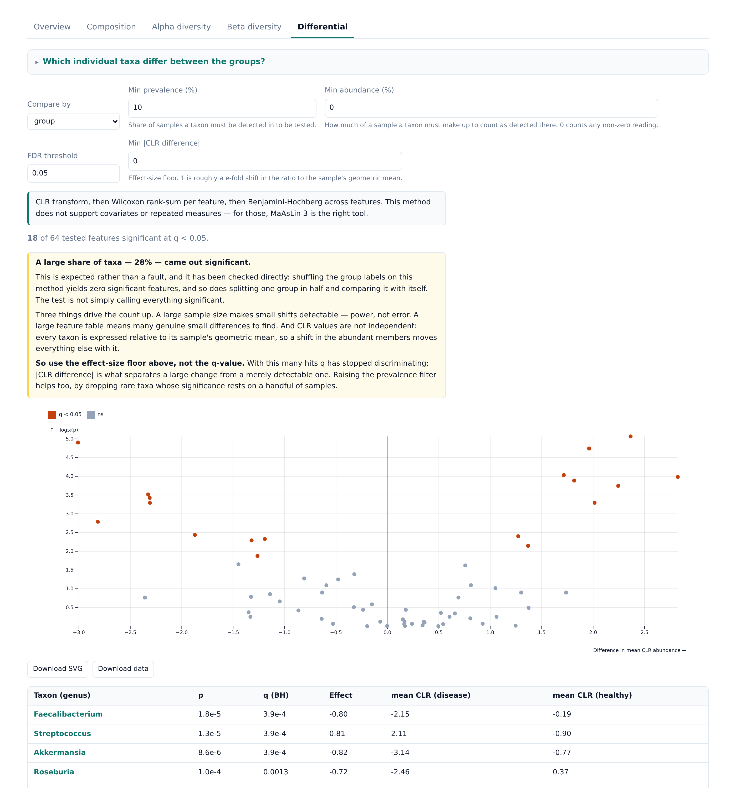

# Microbiome Report

Interactive microbiome analysis that runs entirely in a browser tab. Load a feature table and metadata, get composition, diversity and differential abundance — **your data is never uploaded.**

MicrobiomeAnalyst, Nephele, Namco and MiCloud are all servers you upload to. That is structural, not a feature gap, and it is why many hospital IRBs and consent terms rule them out. This tool has no server at all.

## Get started

**[⬇ Download microbiome-report.html](../../releases/latest/download/microbiome-report.html)** — then double-click it.

That is the whole installation. One file, opened by your normal browser. No Node, no terminal, no account, no server. The file contains the entire application, so it keeps working offline, on a locked-down institutional laptop, and in five years when this repository has moved on.

Click **Load demo data** to try it before supplying anything of your own.

It is worth being precise about why this is safe rather than just asserting it. The page has no upload code and no network calls — your table is read by the browser from your own disk, and every number is computed on your machine. You can verify that: open the file while offline, or watch your browser's network tab while you use it. This is also why there is no "sign up" step.

## What it looks like



Parsing reports what it found and what it had to do, before any analysis. **Overview** then summarises the dataset and states the significant findings, with the non-significant ones named too so absence of evidence is not hidden.



**Composition** — stacked relative abundance per sample, grouped by any metadata column, with each group's span bracketed and labelled.



**Alpha diversity** — within-sample diversity across several metrics, with the group comparison tested.



**Beta diversity** — PCoA on Bray–Curtis, Jaccard or Aitchison distance, with PERMANOVA.



**Differential** — CLR plus Wilcoxon or Kruskal–Wallis per taxon, Benjamini–Hochberg across taxa, as a volcano plot and a sortable table.



Every figure exports as SVG, and the numbers behind it as TSV.

## Input files

Only the feature table is required. Taxonomy and metadata each unlock more of the tool, and the interface says which analyses are unavailable without them rather than failing.

Every file may be **TSV, CSV or Excel `.xlsx`** — the delimiter is detected, and `.xlsx` is read in the browser with no conversion step.

### Feature table (required)

Features down the rows, samples across the columns. The first column holds the feature ID; the header row holds the sample IDs.

```
#OTU ID       S001    S002    S003
ASV_1         104     0       57
ASV_2         12      880     3
ASV_3         0       41      219
```

Counts or relative abundances both work, and which one you supplied is detected — abundance-only tables refuse count-only statistics such as Chao1 instead of returning a meaningless number. A transposed table (samples down the rows) is detected and handled. Leading comment lines, as QIIME 2 exports them, are skipped.

For **MetaPhlAn** output, switch Input type to MetaPhlAn and supply the profile directly: the `clade_name` lineages carry their own taxonomy, so no separate taxonomy file is needed.

### Taxonomy (optional)

Without it, features are labelled by ID and everything still runs — you just cannot group by rank. Two layouts are accepted, and which one you have is detected.

Lineage strings, as QIIME 2 and SILVA produce them:

```
Feature ID    Taxon                                          Confidence
ASV_1         d__Bacteria; p__Bacillota; ...; g__Blautia     0.99
```

Or one column per rank, as mothur, DADA2 `assignTaxonomy` and TaxAss produce them:

```
OTU      Kingdom     Phylum       Class          Order   Family   Genus
ASV_1    Bacteria    Bacillota    Clostridia     ...     ...      Blautia
```

Both `d__` and `k__` prefixes are accepted, confidence values in parentheses are stripped, and **a gap in a lineage is never filled by shifting a lower rank up** — a missing Class stays missing.

### Metadata (optional)

One row per sample. The sample-ID column is found by matching against the table's sample IDs, so it does not have to be first or carry a particular name.

```
sample-id    group     timepoint    depth_m
S001         disease   week0        2.5
S002         healthy   week0        11.0
```

Columns are typed as categorical or numeric automatically. Categorical columns become the grouping variables for every comparison; a column that is constant, or unique per sample, is excluded from the grouping menu with the reason given. Samples present in one file but not the other are reported, not silently dropped.

## Status

- ✅ Parsers: QIIME2 export, DADA2 seqtab, generic TSV/CSV, MetaPhlAn v3/v4, Excel `.xlsx`
- ✅ Taxonomy in lineage-string or one-column-per-rank form, normalised with diagnostics
- ✅ Alpha diversity, beta diversity, PCoA, PERMANOVA
- ✅ Differential abundance (CLR + Wilcoxon/Kruskal-Wallis + BH)
- ✅ SVG and TSV export on every plot
- ✅ Validated against two published datasets — see [`validation/`](./validation)

## Packages

| | |
|---|---|
| [`microbiome-core`](./microbiome-core) | Parsers and compositional statistics. Pure TypeScript, no DOM, **zero runtime dependencies**. |
| [`microbiome-app`](./microbiome-app) | React interface. Vite, Observable Plot, static build — also buildable as a single self-contained HTML file. |
| [`validation`](./validation) | Checks against published datasets, with findings recorded. |

The core is separate so the statistics can be tested and versioned independently of the interface — and so it is usable on its own.

## Building from source

Only needed to modify the tool or to build the single file yourself rather than downloading it. Requires Node 22 or newer.

```bash
cd microbiome-core && npm install && npm test
cd ../microbiome-app && npm install && npm run dev
```

Open the URL Vite prints. To rebuild the downloadable file:

```bash
cd microbiome-app && npm run build:standalone
```

The result is `microbiome-app/dist/microbiome-report-standalone.html` — the same artefact the release link serves, produced by the same command in CI.

## Design principles

**Fail loudly, never silently.** Every parse produces diagnostics: mixed `d__`/`k__` prefixes, stripped SILVA whitespace, samples dropped in the metadata join, uneven sequencing depth. The complaints that motivated this tool were all about silent corruption.

**Refuse invalid analyses rather than obliging.** Chao1 is estimated from singletons and doubletons, so on relative abundances it is refused with that reason stated — not computed into a meaningless number.

**Never shift a taxonomic rank to fill a gap.** When a lineage skips Class, Class becomes null and Order stays at Order. Shifting is the bug behind "Phylum jumps to Order" reports, and it is invisible downstream.

## Licence

MIT
